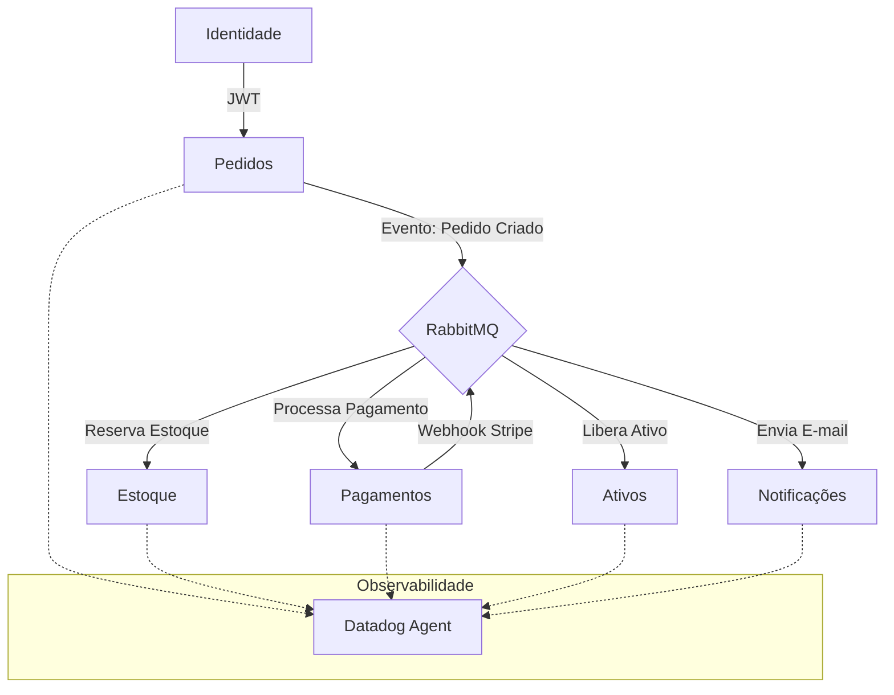

# FashionFlow - Ecossistema de Microserviços de Alta Escalabilidade

O **FashionFlow** é uma plataforma de e-commerce moderna, construída sobre uma arquitetura de microsserviços distribuídos, projetada para garantir resiliência, consistência eventual e observabilidade em escala enterprise.

O projeto utiliza o **Saga Pattern** para gerenciar transações distribuídas e **RabbitMQ** com estratégias avançadas de resiliência (Dead Letter Queues) para garantir que nenhuma transação seja perdida.

---

## 🏗️ Arquitetura do Sistema

O ecossistema é composto por 6 microsserviços independentes, cada um com sua própria responsabilidade e banco de dados isolado (Database-per-Service):



---

## 🚀 Tecnologias e Padrões de Projeto

### Core Técnico
*   **Linguagem**: Python 3.11+
*   **Framework**: FastAPI (Alta performance e Tipagem forte)
*   **ORM**: SQLAlchemy com PostgreSQL (Persistência robusta)
*   **Mensageria**: RabbitMQ (Protocolo AMQP)
*   **Containerização**: Docker e Docker Compose

### Engenharia de Resiliência
*   **Saga Pattern (Orquestração/Compensação)**: Implementação de lógica de estorno automático. Se um pagamento falha no Stripe, o estoque reservado é devolvido e o pedido é cancelado automaticamente via eventos.
*   **Dead Letter Queues (DLQ)**: Configuração de "UTI de mensagens". Mensagens que falham repetidamente são movidas para filas de auditoria, evitando o bloqueio do fluxo principal.
*   **Mensageria com TTL**: Todas as filas possuem tempo de vida definido para evitar mensagens obsoletas.

### DevOps & Observabilidade
*   **CI/CD**: Pipeline automatizado via **GitHub Actions** realizando Linting (Flake8) e Testes Unitários/Integração (Pytest) a cada push.
*   **Tracing Distribuído**: Integração nativa com **Datadog Agent** (ddtrace) para monitoramento de latência e gargalos entre serviços.
*   **TDD (Test Driven Development)**: Cobertura de testes garantindo que fluxos críticos (como geração de JWT) funcionem conforme o esperado.

---

## 🛠️ Como Executar o Ecossistema

O projeto é 100% dockerizado. Para subir todos os serviços, bancos de dados, mensageria e monitoramento, basta um comando:

```bash
# Subir todo o ambiente em modo background
docker-compose up -d --build
```

### Endpoints Principais (Swagger UI):
*   **Identidade**: [http://localhost:8000/docs](http://localhost:8000/docs)
*   **Pedidos**: [http://localhost:8001/docs](http://localhost:8001/docs)
*   **Pagamentos**: [http://localhost:8002/docs](http://localhost:8002/docs)
*   **RabbitMQ Management**: [http://localhost:15672](http://localhost:15672) (convidado / convidado)

---

## 📐 Padrões de Código e Diretrizes

Este projeto segue rigorosamente o guia de estilo **Antigravity**, focado em legibilidade e manutenibilidade para equipes brasileiras:

1.  **Idioma**: Todo o código, variáveis e documentação em **Português Brasileiro (pt-br)**.
2.  **Nomenclatura**: `PascalCase` para classes e `snake_case` para funções/variáveis.
3.  **Docstrings**: Padrão Google para documentação de métodos e classes.
4.  **Idempotência**: Consumidores RabbitMQ projetados para serem idempotentes, garantindo segurança em caso de reprocessamento de mensagens.

---

## 🧪 Validando o Funcionamento

Para garantir a integridade do sistema, você pode rodar a suíte de testes interna:

```bash
# Rodar testes de integração da Identidade
docker exec fashionflow_identidade pytest testes_identidade.py
```

Você também pode simular uma compra completa criando um usuário, fazendo login e postando um pedido no serviço de **Pedidos**. Acompanhe o estoque sendo reservado em tempo real no banco de dados!

---

*Desenvolvido com foco em excelência técnica e arquitetura de sistemas distribuídos.*
