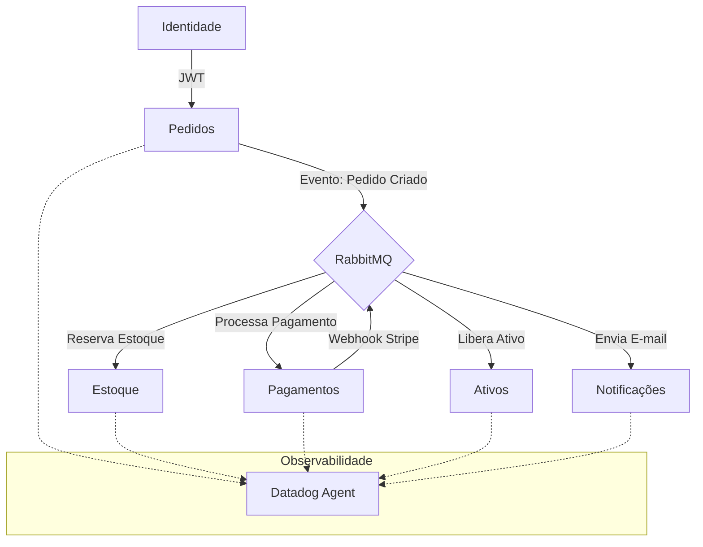

# 👗 FashionFlow - Ecossistema de Microserviços de Alta Escalabilidade (EDA)

Bem-vindo ao **FashionFlow**, uma plataforma de e-commerce moderna, construída sob os princípios de **EDA (Event-Driven Architecture)** e Microsserviços, projetada para garantir resiliência, consistência eventual e observabilidade em escala enterprise.

Este projeto demonstra o domínio de tecnologias de ponta e padrões de arquitetura distribuída (**Saga Pattern**), sendo uma vitrine de engenharia de software para sistemas de alta criticidade.

---

## 🌟 Diferenciais Técnicos (Nível Enterprise)

1.  **Arquitetura EDA & Saga Pattern**: Orquestração assíncrona entre serviços via RabbitMQ (Coreografia), garantindo desacoplamento máximo e resiliência a falhas parciais.
2.  **Segurança Auditada**: Proteção contra vulnerabilidades de **ReDoS** (FastAPI 0.109.1) e implementação de **Idempotência** rigorosa em fluxos financeiros e de entrega.
3.  **CI/CD de Alta Fidelidade**: Pipeline no GitHub Actions que utiliza **Service Containers com PostgreSQL 15 real**, garantindo que os testes de integração reflitam o comportamento exato de produção.
4.  **Cloud-Native (AWS Ready)**: Estrutura preparada para deploy em **AWS ECS Fargate**, utilizando **RDS** para dados e **Amazon S3** para armazenamento de ativos digitais.
5.  **Observabilidade com Datadog**: Injeção de **Distributed Tracing** (ddtrace) para monitorar latência e gargalos entre os 6 microsserviços.

---

## 🏗️ Arquitetura do Sistema

O ecossistema utiliza a estratégia de **Database-per-Service** para garantir que cada motor seja independente:



---

## 🚀 Como Executar o Ecossistema

### 1. Pré-requisitos
*   [Docker](https://www.docker.com/) e Docker Compose instalados.
*   [Stripe CLI](https://stripe.com/docs/stripe-cli) (para simular pagamentos reais).

### 2. Inicialização Rápida
Na raiz do projeto, execute:
```bash
docker-compose up -d --build
```
*Isso subirá o PostgreSQL, RabbitMQ e todos os 6 Microsserviços.*

### 3. Configurando o Pagamento (Stripe)
1.  Faça login: `stripe login`
2.  Inicie o redirecionamento: `stripe listen --forward-to localhost:8002/webhook`

---

## 🔍 Qualidade e Documentação

### 1. Testes Automatizados (via Docker)
```bash
# Testes de Identidade (Registro, Login, JWT)
docker exec fashionflow_identidade pytest testes_identidade.py

# Testes de Pedidos (Autorização e Saúde)
docker exec fashionflow_pedidos pytest testes_pedidos.py
```

### 2. Endpoints e Dashboards
*   **Identidade**: [http://localhost:8000/docs](http://localhost:8000/docs)
*   **Pedidos**: [http://localhost:8001/docs](http://localhost:8001/docs)
*   **Pagamentos**: [http://localhost:8002/docs](http://localhost:8002/docs)
*   **RabbitMQ**: [http://localhost:15672](http://localhost:15672) (`convidado` / `convidado`)

---

## 🛠️ Stack Tecnológica
*   **Backend**: Python (FastAPI), SQLAlchemy, Pika (RabbitMQ).
*   **Frontend**: React, Tailwind CSS, Framer Motion.
*   **Infra**: Docker, PostgreSQL, Datadog (Tracing Distribuído).
*   **Padrões**: Saga (Coreografia), Repository Pattern, Clean Code (PT-BR).

---
*Desenvolvido com foco em excelência técnica, resiliência e arquitetura orientada a eventos.*
